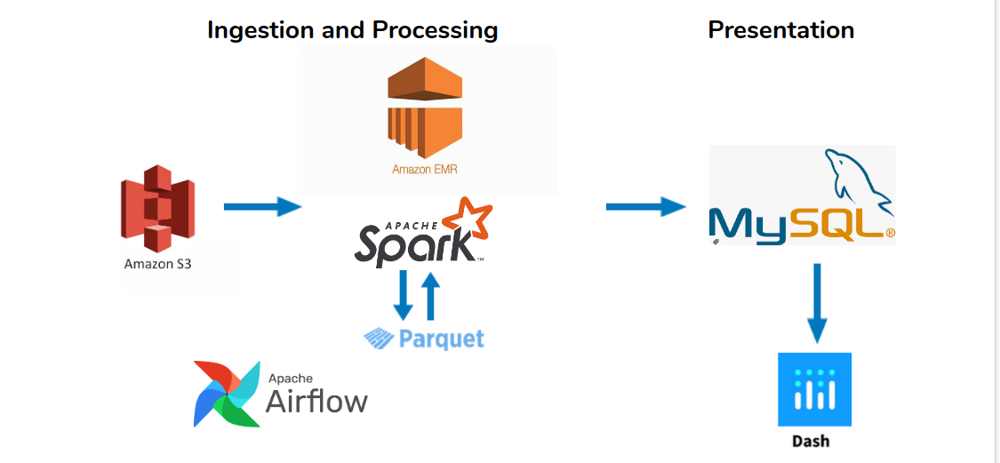

# Business Online
Revealing online presence metrics for businesses

## Introduction
Business online presence is key for success. If you are a business owner, wouldn’t it be nice if you could have a place to see how is your business doing online, who is talking about your business, and what is the overall sentiment across news or social media.
Solution: Web application which provides businesses quick and easy access to their online presence metrics. Specifically, businesses can see how often are they mentioned online over time, what is the overall sentiment, and also they can compare how are they doing against some of other competing businesses.

## Dataset
Used the Common Crawl data set which is stored on Amazon S3 ([Common Crawl](https://commoncrawl.org/)). Data is saved in WARC files. It stores information about all URLs it crawled, including dates when they were crawled and html content.

## Architecture


## Creating Amazon EMR cluster
* Create the EMR cluster
* Go with the advanced installation
* Check Hadoop, Hive, Spark, Zeppelin
* Enable ssh and pick your ec2 key
* Setup a custom bootstrap option: upload install_py_modules.py to an s3 bucket and set it up as a bootstrap script

## Create MySQL Database
* Use Amazon RDS to create DB
* connect to db with mysql command 
```bash
mysql -u user -p password -h hostname
```

## How to manually run different parts of the pipeline
Note: All jobs are tuned to run optimally on a 10 node spark cluster (node size m5.xlarge)
* Clone the project git repository
* Run jobs in the following order:
1. repartition index job (Note: Replace 'CC-MAIN-2020-34' with crawl snapshot you want to process)
```bash
spark-submit \
    --packages org.apache.hadoop:hadoop-aws:3.2.0 \
    ./repartition_cc_index.py \
    --crawl "CC-MAIN-2020-34"
```
2. download cc data (Note: Replace 'CC-MAIN-2020-34' with crawl snapshot you want to process, and bucket can be between 0-9)
```bash
spark-submit \
    --executor-memory 2G \
    --num-executors 40 \
    --packages org.apache.hadoop:hadoop-aws:3.2.0 \
    ./download_cc_data.py \
    --crawl "CC-MAIN-2020-34" \
    --bucket 6
```
3. cross-join job
```bash
spark-submit \
    --executor-memory 5G \
    --num-executors 14 \
    --packages org.apache.hadoop:hadoop-aws:3.2.0 \
    ./cross_join.py \
    --crawl "CC-MAIN-2020-34" \
    --bucket 6
```
4. calculate mentions job
```bash
spark-submit \
    --executor-memory 5G \
    --num-executors 14 \
    --packages org.apache.hadoop:hadoop-aws:3.2.0 \
    ./mentions.py \
    --crawl "CC-MAIN-2020-34"
```
5. calculate sentiment job
```bash
spark-submit \
    --executor-memory 5G \
    --num-executors 10 \
    --packages org.apache.hadoop:hadoop-aws:3.2.0 \
    ./sentiment.py \
    --crawl "CC-MAIN-2020-34"
```
6. write to db job (Note: replace hostname, db_name, username, password with your info)
```bash
spark-submit --packages org.apache.hadoop:hadoop-aws:3.2.0 \
    --executor-memory 1G \
    --num-executors 1 \
    ./write_to_db.py \
    --crawl "CC-MAIN-2020-34" --endpoint "hostname" \
    --db "db_name" --user "username" --password "password"
```
## How to install Airflow on EMR
* After you created EMR cluster, SSH to master node an run below commands
```bash
export AIRFLOW_HOME=~/airflow
sudo yum install python3-devel
sudo /usr/bin/pip3 install apache-airflow
airflow initdb
```
* Copy pipeline.py file to ~/airflow/dags
* Start the web server on port 8081
```bash
airflow webserver -p 8081
```
* Start the scheduler
```bash
airflow scheduler
```
## How to kick off the pipeline using Airflow
Run the following command
NOTE: Replcae 'CC-MAIN-2020-29' with the crawl snapshot you want to process, and for the start and end date, put the first day of the month of that snapshot.
```
airflow backfill --conf '{"crawl":"CC-MAIN-2020-29" }' -s 2020-10-01 -e 2020-10-01 pipeline 
```


